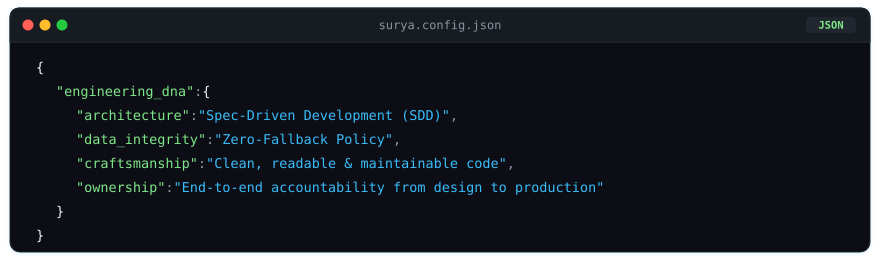

  

 

### 👨‍💻 About Me
Hi, I'm Surya! Just a tech enthusiast who loves web development, building practical apps, exploring system architecture, and experimenting with new tools. Lately, I've been diving deeper into FastAPI, spec-driven development, and handling complex business rules.

  

*"I don't claim to know everything, but I love getting my hands dirty with code, learning how systems work under the hood, and collaborating with others to build tools that actually help people."*

 

  

 

### 🛠️ Tech Stack

  

 

  

